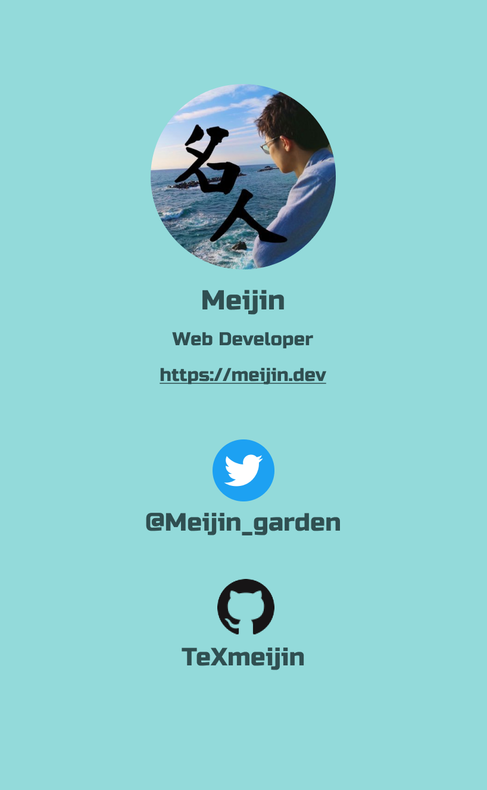

<!-- classes: title -->

<h1>
<span>React Native×Firebaseで</span>
<span>オンライン指導用の</span>
<span>チャットアプリを開発している話</span>
</h1>

<!-- block-start: grid -->
<!-- account: twitter, meijin_garden -->
<!-- block-end -->

---

<!-- section-title: 目次 -->

# 目次

- 自己紹介
- 開発しているサービス
- アプリで開発している機能
- 開発体制
- React Nativeの利用ライブラリ
- React Nativeの品質管理
- React Nativeの落とし穴
- Firebaseの利用ライブラリ
- Firebaseの設計
- Firebaseの落とし穴
- この技術選定で良かったと思うこと
- まとめ

---

# 自己紹介

<!-- block-start: grid -->
<!-- block-start: column -->

<figure>

</figure>

<!-- block-end -->
<!-- block-start: column, left, flex-start -->

- ハンドルネーム”名人”
- 株式会社NoSchool CTO
- オンライン家庭教師を広める教育サービスを開発しています(https://manalink.jp)
- 好きな言語はTypeScript
- 趣味
  - 将棋(指すのも観戦するのも好き)
  - ゲーム(最近はゼルダ無双)

<!-- block-end -->
<!-- block-end -->

---

# 開発しているサービス

<!-- block-start: grid -->
<!-- block-start: column -->


<!-- block-end -->
<!-- block-start: column, left, flex-start -->

- マナリンク
- 中高生向けのオンライン家庭教師サービス
- 「優秀な先生が世界中どこに居ても教育の仕事ができるようにする」が目標
- 先生を一人ひとり審査していて、カナダ在住の先生とか、中高生に株を教える個性的な先生など在籍している
- Web上で先生を探して指導依頼ができる
- 指導開始後はアプリを使ってご家庭↔先生でやり取りができる

<!-- block-end -->
<!-- block-end -->

---

# 図にするとこんな感じ

---

<!-- classes: left -->

# アプリで開発している機能

## いま
- 先生、生徒、保護者が利用できる
- チャット(文章、各種ファイル)で連絡できる
  - iOS / Android対応
  - Web↔アプリ間でもチャットができる

## これから
- 先生が勉強計画を立て、日々生徒が報告する機能
- 試験日や指導日を共有できる管理機能

**→先生個人がデジタル化した指導を実践できるようにしていく**

---

# アプリの開発体制と利用技術

<!-- block-start: grid -->
<!-- block-start: flex -->


<!-- block-end -->
<!-- block-start: column, left, flex-start -->

- 開発体制
  - 業務委託エンジニア1名(+ときどきCTO)
  - めっちゃベンチャーです
- 利用技術
  - React Native
  - Expo(Managed Workflow)
  - Firebase
  - TypeScript

<!-- block-end -->
<!-- block-end -->

---

# React Nativeの利用ライブラリ

---

<!-- classes: left -->

# react-native-gifted-chat

<!-- block-start: grid -->

<!-- block-start: column -->

```jsx
<GiftedChat
  messages={chatMessages}
  onSend={onSend}
  placeholder="メッセージを入力"
  renderBubble={renderBubble}
  renderInputToolbar={renderInputToolbar}
  renderActions={renderActions}
  renderComposer={renderComposer}
  renderSend={renderSend}
  renderMessageImage={renderMessageImage}
  infiniteScroll
  // 以下略
/>
```

<!-- block-end -->
<!-- block-start: column, left -->

- チャット画面を丸っと囲うGiftedChatコンポーネントを置くだけ
- 各メッセージや送信ボタンなどは外からFunctionalなComponentを渡すことでカスタマイズできる
- カスタマイズしすぎるとライブラリの範囲を逸脱してくるので、いつかはリプレイスする

<!-- block-end -->
<!-- block-end -->

---

# チャットをゼロから作るのは割と大変

<!-- block-start: grid -->
<!-- block-start: flex -->


<!-- block-end -->
<!-- block-start: column, left, flex-start -->

#### 以下の内容はreact-native-gifted-chatがやっている

- チャットの吹き出しの形
  - よく見ると、連投したときの角丸の形が微妙に違う
  - 連投すると最後の投稿だけユーザーアイコンがつく
- 日時表示
  - 日付が変わるたびに日付表示をインサートしている
- 表示位置
  - 新着メッセージが来るたびに自動でスクロール

WebではVueで全部自作したけど結構大変だった(勉強にはなった)

これを機にLINEのUIをじっくり眺めるととても感心した思い出

<!-- block-end -->
<!-- block-end -->

---

# Firebase×React Hooks関連のライブラリ

## react-firebase-hooks

- https://github.com/CSFrequency/react-firebase-hooks
- FirestoreのCollectionデータ、読み込み中フラグ、エラー内容をセットで返すHook

```typescript
const [values, loading, error] = useCollectionData<T>(query, options);
```

<br />

## react-firebase-pagination-hooks

- チャットのメッセージをページングして、無限スクロールを実装
- loadMoreメソッドを実行すれば次のデータが読み込める

```typescript
const [messages, { loaded, loadingMore, loadMore }, error] = usePaginationData<T>(query, options);
```

---

# React Nativeの品質管理

- React Nativeに関してはテストコードは皆無(汗)
  - 機能が少なく、ライブラリ依存が大きいため
  - 毎回ウォークスルーテストを手動でしている
  - 複雑なフックが増えてきたので書きたい気持ちはある
- エラー検知はSentry
  - 画面遷移やメッセージ送信時などでイベントを発火して記録
  - エラーログが出ると、イベントを辿ることでユーザーの動きを擬似再現できる
  - ユーザーIDも紐付けができる
  - ソースマップをSentryにデプロイすることで、エラーが起きたソースコードの該当箇所を特定しやすい

```typescript
Sentry.addBreadcrumb({
  category: 'ACTION',
  message: 'SEND_CHAT_MESSAGE',
  data: {
    roomId: room.id,
    userId: user.id,
  },
});
```

---

# React Nativeの落とし穴

## ハマると解決が厳しい

- 某ライブラリと某ライブラリを併用し、かつ特定の動作をユーザーが行うとアプリがクラッシュする事案があった
  - 画面が突然ブラックアウトして強制的に再起動になる
  - 発動条件がニッチだが、本番環境で再現するユーザーがいて修正必須となった
- 直接的な原因が全く不明
  - クラッシュが突然ブラックアウトするためエラーログが取れない
  - ライブラリのソースを追っても、ある程度追うとネイティブのコードになり謎が深まる

結局何が原因か分からないままに、当該ライブラリの組み合わせを変えることで解消...

---

## いつでもiOS/Androidで同じと思うなよ

- チャットで画像を送信するとき、画素数を落とさずにファイルサイズを小さくするために圧縮した
  - expo-image-manipulatorを使った
  - ImageManipulator.manipulateAsyncで圧縮しようとすると、同じ圧縮率を指定してもAndroidから実行すると**画像が圧縮されすぎてしまった**
  - OSごとに分岐して圧縮率を調整することで解消
  - ソースレビューの段階では何ら問題なく見えるので恐ろしい
- 他にも通知周りなど、細かいところで結局OSごとに分岐する箇所があるので、両OSでの実機確認は必須

---

# Firebaseの利用ライブラリ

---

## firestore-simple

```typescript
const roomDao = firestoreSimple.collection<Room>({ path: 'rooms' })
const allRooms = await roomDao.fetchAll()
```

---

# Firebaseの設計

---

# Firebaseの落とし穴

---

# この技術選定で良かったと思うこと

---

## 1. 簡単な修正ならWebエンジニア(僕)でも理解・実装できる

- そもそもReactが個人的に好き(突然の主観)
  - 最近練習を兼ねてRNで個人開発しているが、TSXを書くのが楽しいしスタイルもCSS感覚なので敷居が本当に低い
- 特にExpoのManaged Workflowの場合は環境構築時に各OSの存在をほとんど意識しなくて良いので楽
- 実例として、FrontのFirebaseは全く同じライブラリをVueでも使っているので、Webのコードをほぼそのままコピペで持ってこれる
  - 先日FirebaseのStorageにファイルを上げる時に、content-dispositionヘッダを指定することでダウンロード時にファイル名を維持する施策を実装したが、ほぼ同じコードでWeb/アプリを実装できたので便利さを実感した
  - コードそのものを共有するのは限界があるので、相互に人材および知見を共有できる程度に思っている

---

## 2. 受験シーズンに間に合うように開発でき、機能検証ができた

- 昨年6月から開発スタートし、紆余曲折あったが10月にはリリースできた
- オンライン指導用のアプリなので、クロスプラットフォームで平等に使ってもらう必要があった
- React Nativeで開発することで受験シーズンに間に合い、積極的に使ってもらうことができた
- **チャットで親・先生・生徒がやり取りでき、ファイルや画像も送れるのはIT界隈の人間からすると当然だが、案外事業者側でそこまで内製する企業が少ないらしく、特に先生から好評をいただくことができた**
  - 実際、チャット機能は作り込みだすとそれなりに大変ですが(小声)
- 総じて、**教育事業が最も盛り上がる受験シーズンまでに、最低限どんな機能があればニーズが満たせるか理解できた**ので、React Nativeをやってよかった
  - スタートアップの検証サイクル的にはとても有り難い技術
  - (初期リリースの内容を予定から絞って、チャットをまずは作り込む判断も良かった)

---

# まとめ

---

## 言いたいことメモ

- React Native×TSX×Hooksをベースに開発している
- Firebaseも含めて全部TypeScriptで完結している
- Webエンジニアでも簡単なHooksの改善程度なら積極的に参加できる
- react-firebase-hooks, firestore-simpleおすすめ
- 謎のクラッシュなど、ハマると結構打つ手なくなるのがしんどい
- 画像の圧縮時にAndroidとiOSで地味に違う挙動が起こる罠ｗ
- Expoのプッシュ通知が割と落ちるのでリトライ機構を組んだ
- FirestoreはWriteを頑張り、Readがシンプルで済むように組むのがベター
- 限られた開発体制でも短期間で開発でき受験シーズンに間に合った。チャット機能でミニマムどれくらい機能が必要かも分かった。スタートアップの検証サイクル的にはとても有り難い技術。